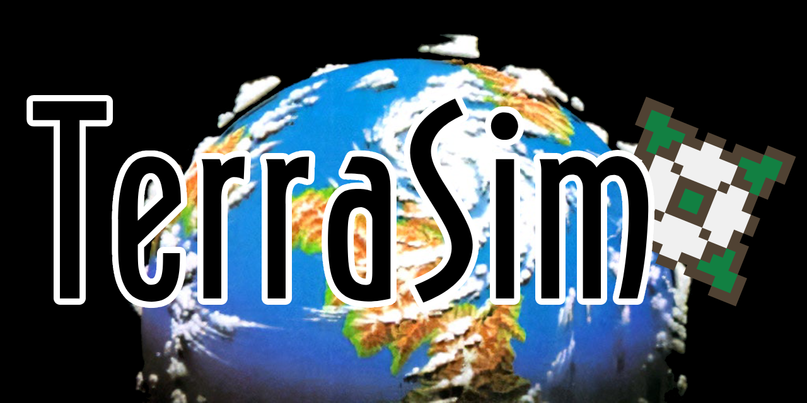

# TerraSim



A SimEarth clone in OCaml using [tsdl](https://erratique.ch/software/tsdl) and [tgls](https://erratique.ch/software/tgls).

See [roadmap.md](./roadmap.md) for progress

## Building

```bash
opam install . --deps-only
dune build
```

To run, simply

```bash
dune exec TerraSim
```

## Controls

There are three views right now:

### Edit view (Cartesian)

| Input | Effect |
|---|---|
| Mouse move | Pan view |
| LMB | Raise terrain (volcano) |
| RMB | Lower terrain (meteorite) |
| `c` | Switch to Atlas view |

### Atlas view (Cartesian)

| Input | Effect |
|---|---|
| Mouse move | Pan view |
| `c` | Switch to Globe view |

### Globe view (Orthographic)

| Input | Effect |
|---|---|
| Left | Rotate West |
| Right | Rotate East |
| `c` | Switch to Edit view |
